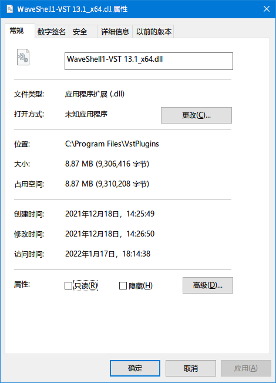

## 【VST】诶？有些 VST 插件是好几个插件组成的……
日期：2022-01-28

对于多数 VST 插件，一个库文件（*.dll，或 *.vst3）对应一个插件。而有些 VST 插件中，一个库文件含有多个插件：

  


这里讲一下这样的插件是什么，以及加载和使用这些插件的方式。

### VST2 - VST2 Shell
VST2 添加了 VST Shell 这一特性。VST Shell 可以使一个库文件容纳多个插件。

在多数 DAW 软件中，VST 插件的使用分为两步：程序先扫描插件，然后加载相应的插件。
#### 扫描插件
当扫描插件时，程序获取了插件的路径，加载库，运行入口函数，获取到 `AEffect*`：
```cpp
// Windows
using PluginEntryProc = AEffect* (*)(audioMasterCallback); // 入口函数的类型

VstIntPtr VSTCALLBACK HostCallback(AEffect* effect, VstInt32 opcode, VstInt32 index,
                                   VstIntPtr value, void* ptr, float opt); // 宿主程序的回调函数
void scanSimplePlugin(const std::wstring& path)
{
    // 加载 DLL
    // RAII 是好文明，这儿懒得写了；多字节字符集是坏文明，因此不使用
    auto module = LoadLibraryW(path.c_str());
    if(!module)
    {
        // 错误处理
    }
    auto proc = reinterpret_cast<PluginEntryProc>(GetProcAddress(module, "VSTPluginMain"));
    if(!proc)
    {
        proc = reinterpret_cast<PluginEntryProc>(GetProcAddress(module, "main"));
        if(!proc)
        {
            // 错误处理：文件可能不是 VST2 插件
        }
    }
    AEffect* effect = proc(HostCallback);
    // 接下来怎么做？
}
```
如果不考虑 VST Shell，那么接下来的事情相当简单，因为此时已经拿到了能够使用的 `AEffect*`；要考虑 VST Shell，则稍微麻烦一些。首先需要获知插件是否为 Shell 类型：
```cpp
    auto category = effect->dispatcher(effect,
    AEffectXOpcodes::effGetPlugCategory, // 不限域
    0, 0, nullptr, 0);
```
如果是 Shell 类型，则逐个获取 Shell 中插件的信息即可：
```cpp
    if (category == kPlugCategShell)
    {
        VstIntPtr shellPluginId;
        std::array<char, kVstMaxProductStrLen> nameBuffer = {0};
        while (true)
        {
            shellPluginId = effect->dispatcher(effect,
            AEffectXOpcodes::effShellGetNextPlugin, 0, 0, nameBuffer.data(), nameBuffer.size());
            if(shellPlluginId == 0 || nameBuffer[0] == 0)
            {
                break;
            }
            // 得到了 ID（shellPluginId）和名称（nameBuffer）
        }
    }
    else
    {
        // 不是 Shell
    }
```
到这里，我们的代码可以扫描 VST2 Shell 了。
#### 加载插件
接下来是加载 VST2 Shell 中的插件。这个过程稍微麻烦一些。  
加载 Shell 中插件的过程大致如下：
1. 加载库并寻找入口函数；
2. 让宿主程序得知要使用 Shell 中的哪个插件。这里我们需要的是插件的 ID；
3. 插件通过调用宿主的回调函数的方式询问宿主程序要加载的插件 ID；
4. Shell 得知需要的插件后，进行加载，返回需要的 `AEffect*`。

由于之前进行了扫描，宿主程序可以在还没开始加载库文件的时候得知需要的 ID。
插件询问 ID 时，调用宿主的回调函数。我们回忆一下往常加载插件时的代码：
```cpp
    PluginEntryProc proc;
    AEffect* proc = proc(HostCallback); // *
```
插件询问 ID 的过程就发生在 `proc(HostCallback)` 中，传入的 `opcode` 为 `AudioMasterOpcodes::audioMasterCurrentId`。根据这些信息，我们可以写出以下代码：
```cpp
VstIntPtr VSTCALLBACK HostCallback(AEffect* effect, VstInt32 opcode, VstInt32 index,
                                   VstIntPtr value, void* ptr, float opt) // 宿主程序的回调函数
{
    switch (opcode)
    {
        if (opcode == AudioMasterOpcodes::audioMasterCurrentId) // 不限域
        {
            // 返回插件 ID
        }
        else
        {
            // 处理其他 opcode
        }
    }
}
```
在回调函数中得知插件 ID 的方式就很多了。一个比较简单的方法是使用全局变量：
```cpp
VstIntPtr pluginId;
void loadPlugin(const std::wstring& path, VstIntPtr id)
{
    pluginId = id;
    // 往常加载插件的代码
}

VstIntPtr VSTCALLBACK HostCallback(AEffect* effect, VstInt32 opcode, VstInt32 index,
                                   VstIntPtr value, void* ptr, float opt) // 宿主程序的回调函数
{
    switch (opcode)
    {
        if (opcode == AudioMasterOpcodes::audioMasterCurrentId) // 无限域
        {
            return pluginId;
        }
        else
        {
            // 处理其他 opcode
        }
    }
}
```
#### 注意事项和问题
上面的代码虽然能够成功加载插件，但是还有一些细枝末节需要注意：
1. 在成功加载插件 Shell 后，我们无法立刻获知插件的个数，而需要逐个获取。
1. 在逐个获取插件的信息时，我们只能获取 ID 和名称，而不能获取其他的信息（如插件是否为乐器等）。  
   多数 DAW 软件中，扫描插件的操作完成后，用户可以得知插件的名称和类型。如果我们需要在自己的程序中做到这一点，需要在获取到 ID 和名称后，使用每个插件的 ID 加载插件，然后获取相应信息。

我们发现，使用 VST Shell 时，代码相对难写一些。幸运的是，VST3 中，编写和使用多个插件的容器变得简单了不少。
### VST3 - 导出类
VST3 新增了导出类的特性。插件的开发者可以方便地给一个项目加入多个类和相应信息；宿主程序的开发者可以方便地获取插件导出类的个数和相应信息。

扫描插件的代码大致如下：
```cpp
using VST3FactoryFunction = IPluginFactory* (*)();
auto proc; // 从库文件中获取的工厂函数
auto factory = proc();
auto classCount = factory->countClasses();
for(decltype(classCount) i = 0; i < classCount; ++i)
{
    PClassInfo classInfo;
    factory->getClassInfo(i, &classInfo);
    // 读取 classInfo
}
```
### 来源
[audio - How do I scan/enumerate vst plugin dlls? - Stack Overflow](https://stackoverflow.com/questions/1128958/how-do-i-scan-enumerate-vst-plugin-dlls)